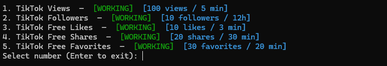

<h1>Tiktok View Bot</h1>

<h3>Star goal:</h3>

⭐ 100 Stars – Make it app

<h2>Installation & Usage</h2>
<pre>
<code>
git clone https://github.com/gavaita/Tiktok-View-Bot
cd Tiktok-View-Bot
pip install -r requirements.txt
</code>
</pre>

<h2>Usage</h2>
<pre>
<code>
python3 Tiktok-Bot
</code>
</pre>

<h2>Requirements</h2>

A brain...

  

<h2>Contribution</h2>

https://github.com/AdamBankz

